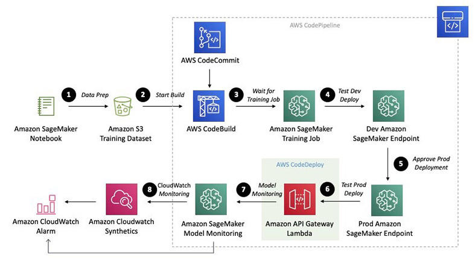

# MLOps Guidance

Here is the original page of the [tutorial of MLOps](https://mlops-safe-deployment-pipeline.workshop.aws/)

    

### Agenda
* Prepare for SageMaker Studio
    1. [Launch SageMaker Studio and Prepare Infrastructure](docs/PrepareInfra.md)
    2. [Prepare Project](docs/PrepareProject.md)
* Data Prep -  Please follow the [original Instruction](https://mlops-safe-deployment-pipeline.workshop.aws/01_data_prep.html)
* Build -  Please follow the [original Instruction](https://mlops-safe-deployment-pipeline.workshop.aws/02_build.html)
* Train -  Please follow the [original Instruction](https://mlops-safe-deployment-pipeline.workshop.aws/03_train.html)
* Deploy Dev -  Please follow the [original Instruction](https://mlops-safe-deployment-pipeline.workshop.aws/04_deploy_dev.html)
* Deploy Prod -  Please follow the [original Instruction](https://mlops-safe-deployment-pipeline.workshop.aws/05_deploy_prod.html)
* Monitor -  Please follow the [original Instruction](https://mlops-safe-deployment-pipeline.workshop.aws/06_monitor.html)
* Cleanup -  Please follow the [original Instruction](https://mlops-safe-deployment-pipeline.workshop.aws/07_cleanup.html)