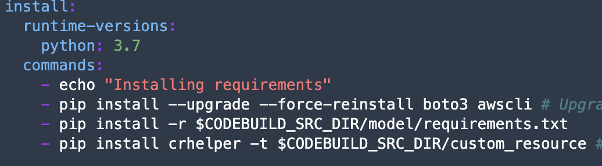
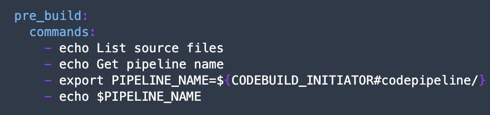
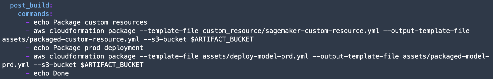
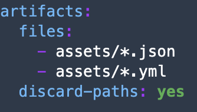

## Build

In build process, we are going to trigger the build process. In this workshop, the MLOps will be using CI/CD Services on AWS. 

you may need to open [CodePipeline Console](https://console.aws.amazon.com/codesuite/codepipeline/start?region=us-east-1) and click `pipelines` menu on the left.

1. Import some libraries and load some environment variables which you will need.
2. training configuration (hyperparameters, train, val, test data, and baseline data)

Baseline data is a data that will be considered as "clean" data, which will be use as a baseline for the model performance. usually, baseline data is being used as a training data as well (sometimes you need 2 csv files with same data, 1 for train and 1 for baseline)

3. upload the zip file and push it to S3.
4. check the codepipeline flow.
5. check codebuild logs.

In Building process, we are going to use `CodeBuild`. CodeBuild process can be defined by creating `buildspec.yml`. Please check folder `/model/buildspec.yml` This is the description for buildpsec.yml:

- it's divided by "Phases", or stages of building and testing your ML code.
- in install phase, it's being used to install libraries that will be use to execute the ML Code (python, boto3). might specify `requirements.txt` file to specify all libraries that you need.

    

- pre-build phase, will get variables that will be used during building process

    

- build phase, execute the code. it will execute `/model/run_pipeline.py` code with parameters specified.

    

- post-build phase, will create artifact that will be used for next step on deployment. This case, will create template workflow file for training (`/custom_resource/sagemaker-custom-resource.yml`) and template infrastructure file for deployment (`/assets/deploy-model-prd.yml`).

    

- artifacts, supported file for next step of deployment.

    

[BACK TO WORKSHOP GUIDE :house:](../README.md)

[CONTINUE TO NEXT GUIDE :arrow_right:](Train.md)

[BACK TO PREVIOUS GUIDE :arrow_left:](DataPrep.md)