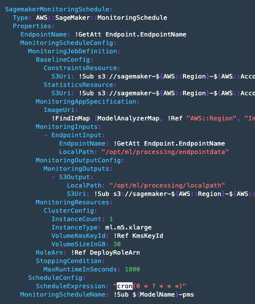

## Monitoring

Model monitoring is a feature on SageMaker that helps to determine the constraint, to check if the model or data has been drifted. To do this, there will be processing behind.

### Inspect Model monitor
1. fetch the execution ID
2. generate processing job name and schedule. This is to run the SageMaker Model monitor, to check the drift on your data and model.

### Explore Baseline
3. get the baseline processing job result
4. get statistics file for each features on baseline data.
5. get constraint file (constraint that data must satisfy), example data type, completeness (not null, not NaN)

### View data capture
incoming requests to the endpoint, as well as the results from the ML model, are stored in an S3 location. Model monitor can analyze this data and compare it to the baseline to ensure that no constraints are violated.
6. check the data capture

### View monitoring schedule
7. get monitoring schedule script
8. check the schedule time

If you check the `/assets/deploy-model-prd.yml`, there is a scheduler for SageMaker Model Monitor, set for each hour, on minute 0 with cron expression.
    

9. fetch completed Model Monitor result. Might encounter violation (the data is not following the constraints)

### View monitoring results
10. check latest monitoring result
11. download the result to local
12. get the baseline and monitoring statistics
13. visual the violation

passenger_count data type might have a `Fractional` data (float), which doesn't make sense, since total passenger can't be float. Also, the total_amount data has 13% violations.

### Trigger retraining
14. create custom cloudwatch metric to retrigger the codepipeline. you might use violation percentage for this metric to retrigger
15. check cloudwatch and codepipeline

### CloudWatch Dashboard
16. create cloudwatch dashboard, containing the latency, CPU, Memory, invocations, etc.

[BACK TO WORKSHOP GUIDE :house:](../README.md)

[BACK TO PREVIOUS GUIDE :arrow_left:](Prod.md)