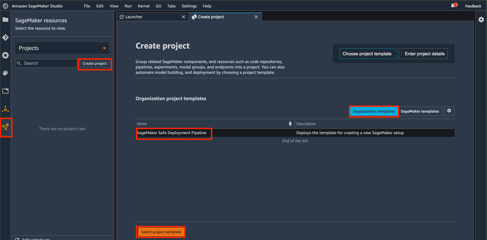

## Launch SageMaker Studio and Prepare Infrastructure

1. Go to [SageMaker Console](https://console.aws.amazon.com/sagemaker/home?region=us-east-1#/)
2. click `Amazon SageMaker Studio`
3. click `Standard Setup` and choose `AWS Identity and Access Management (IAM)`

    

4. in Permission, click `Create a new role`
5. In specifying S3 bucket, leave it as default and click `create role`. Make sure you write down the name of your role.
6. Click Submit

    

This might take a while to run. While waiting, now we are going to try to deploy our infrastructure template using CloudFormation

7. Please [click here in new tab](https://us-east-1.console.aws.amazon.com/cloudformation/home?region=us-east-1#/stacks/quickcreate?templateUrl=https%3A%2F%2Famazon-sagemaker-safe-deployment-pipeline.s3.amazonaws.com%2Fstudio.yml&stackName=mlops-studio&param_PipelineBucket=amazon-sagemaker-safe-deployment-pipeline) To deploy the template. It will bring you to the AWS CloudFormation Console.
8. in `SageMakerStudioRoleName`, Copy the SageMaker studio role you have created in (The one that looks like `AmazonSageMaker-ExecutionRole-<random-numbers-here>`)
9. Please check the checkbox on Capabilities iAM
10. Click `Create Stack`

    

This might take a while to run. Meanwhile, let's give the user permission for Service Catalog. Service catalog is containing the template for our Machine Learning environment.

11. Go to [IAM Console](https://console.aws.amazon.com/iam/home?region=us-east-1#)
12. click `Roles`
13. find your role in search bar by typing your sagemaker role name (The one that looks like `AmazonSageMaker-ExecutionRole-<random-numbers-here>`)
14. click the role name.

    

15. In permission tab, click `Attach policies`
16. Search for `AWSServiceCatalogAdminFullAccess`
17. check the `AWSServiceCatalogAdminFullAccess` policy
18. click `Attach Policy`

    

Now, remove the constraints that service catalog have

25. go to [Service Catalog Console](https://console.aws.amazon.com/servicecatalog/home?region=us-east-1#portfolios?activeTab=localAdminPortfolios)
26. click your Local Portofolios
27. click `Constraints` tab
28. click the radio button besides the constraints
29. click `Delete constraint`
30. Type `delete` and click `delete` button.

Once it's done, let's go back to the SageMaker.

31. Go to [SageMaker Console](https://console.aws.amazon.com/sagemaker/home?region=us-east-1#/landing) and click `Amazon SageMaker Studio`
32. in your SageMaker Studio Control Panel, click `Add user`

    

33. in user name, fill your name.
34. in Execution role, choose the sagemaker role you have created (The one that looks like `AmazonSageMaker-ExecutionRole-<random-numbers-here>`)
35. click `Submit`

    

once you create the account, now let's try to open the studio.

16. click `Open Studio`

    

It will open a new tab. This will take a while, since it needs to initialize the studio that we are going to use.

37. in your sagemaker studio, Click the lowest icon.
38. click `Create project`
39. click `Organization templates`
40. choose `SageMaker Safe Deployment Pipeline`
41. click `Select project template`
42. in project name, fill it with `sagemaker-safe-deployment-proj`
43. change the email address to your email address.
44. click `create project`