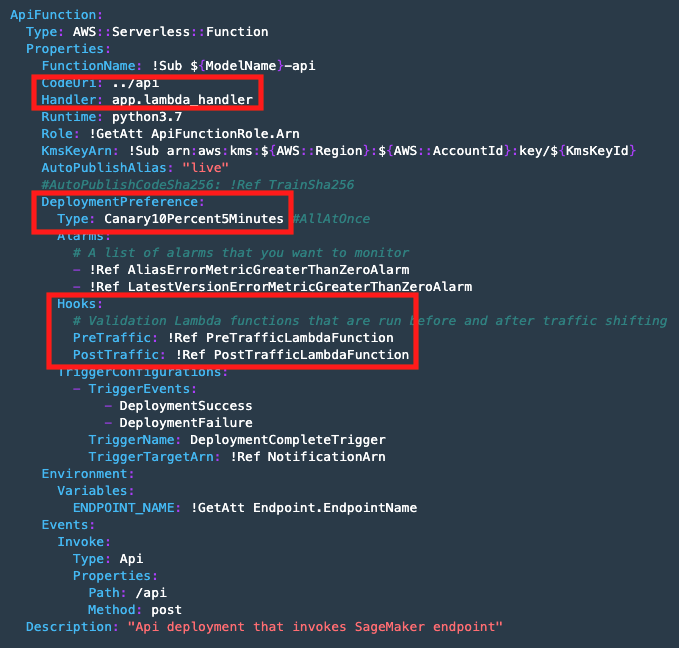

## Deploy production

to deploy from dev to production, manual approval is required. you can check on codepipeline and click approve, or you can execute the code cell.

### Approve Deployment to Production
1. approval for Deployment from dev to prod.

once it's approve, it will trigger to execute code for infrastructure template on `/assets/deploy-model-prd.yml`

### Test Production deployment
2. Extract the deployment progress
3. display the deployment progress

In `/assets/deploy-model-prd.yml`, there are things that you might need to take a look. inside, there is also ways to make the model become an REST API. By default, sagemaker will make your model into REST API, but there are configurations that would be nice to have
- `/api/app.py` is to call the endpoint and to predict the result
- `/api/pre_traffic_hook.py` is a hook (validation for lambda invocation function) to validate if the endpoint is in service or dead.
- `/api/post_traffic_hook.py` is a hook to log the API calls, for auditing purpose.
- `Canary10Percent5Minutes` is a canary method deployment for the model.

    
    

4. Fetch the name of the endpoint.
5. Check the prod deployment status.
6. Predict using prod model

### Test REST API
7. check lambda deployment
8. confirm the endpoint is in service.
9. check CodeDeploy notification (They will send you an email if you subscribe)

Based on the explanation above, the deployment is using canary with 90% traffic on dev, and 10% on Prod. Onc it's good, then the traffic shifts to 100% prod

10. Test to call REST API.

[BACK TO WORKSHOP GUIDE :house:](../README.md)

[CONTINUE TO NEXT GUIDE :arrow_right:](Monitor.md)

[BACK TO PREVIOUS GUIDE :arrow_left:](Dev.md)