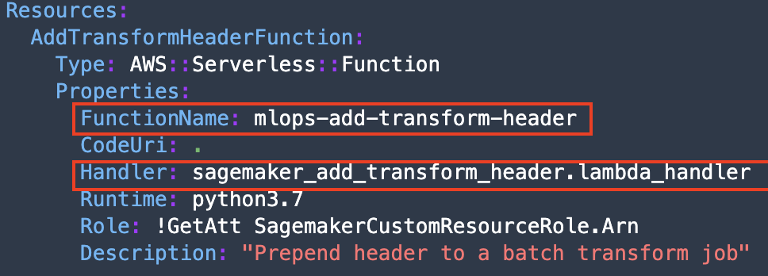
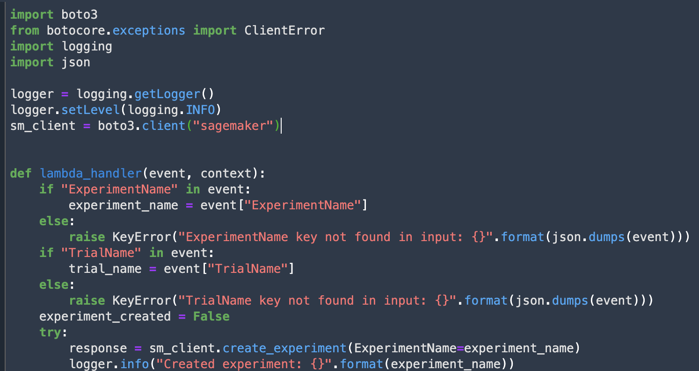

## Train

in training process, we are going to focus towards the processing of the model. We are going to use step function, to create the workflow on training and evaluation of the model.

### Inspect training job
1. Check step function workflow.

the workflow is being created from build process. the build process have executed the infractusture template `/custom_resource/sagemaker-custom-resource.yml`. Here are the descriptions:
- it will create lambda function, for each of the workflow. (check the handler name, with function name)
- handler name format will be `local-script-name.lambda_handler`

    

- in each of the script, it needs to create function named `lambda_handler`. assume this function is a main function.

    

this is the workflow process result, with each of the functions.

    

Workflow explanation:
- `Create Experiment` is to track sagemaker training, process, and transform jobs.
- `Baseline job` is just like training job. but being used as a monitoring process to detect drift model
- `Training job` is to train the model
- `save model` will create the endpoint for dev phase
- `Query training Result` is the evaluation process once the model has been deployed on dev
- `RMSE < 10` is the rule (threshold) to define how well the model is. RMSE (Root Mean Square Error) is an error for regression problem.
- `Model Error accepted` means that the model has passed the test.

### Training analytics
2. Check the training result. There will be baseline and training result. Baseline RMSE result will be NaN since there is no calculation error.

[BACK TO WORKSHOP GUIDE :house:](../README.md)

[CONTINUE TO NEXT GUIDE :arrow_right:](Dev.md)

[BACK TO PREVIOUS GUIDE :arrow_left:](Build.md)